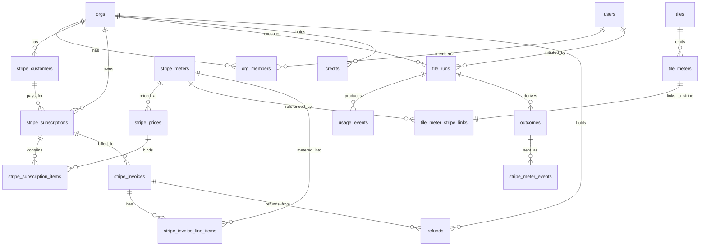
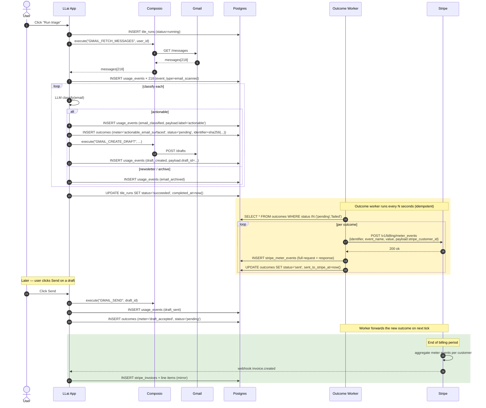

# LogicLemon AI · Outcome-Based Billing — Architecture

Companion to `schema.sql`. Read this first; the SQL file is the ground truth.

---

## Mental model in one paragraph

Stripe runs the **billing engine**. It owns customers, prices, meters, subscriptions, invoices. We **mirror** those entities (so we can query fast and survive Stripe outages) but never treat our copy as truth — Stripe webhooks reconcile us back. On our side, every tile run produces **raw usage events** (everything that happened) which a worker then folds into **outcomes** (the priced units we actually bill on). Each outcome carries a deterministic `identifier` that becomes the Stripe meter-event idempotency key — so the same source events can never bill the customer twice, even on retries or replays.

---

## The five tables that matter

| Table | Role | Mutable? |
|---|---|---|
| `tile_runs` | One row per execution of a tile | yes |
| `usage_events` | Raw, append-only audit log of everything that happened during a run | **no** (insert-only) |
| `outcomes` | Priced units. One row = one Stripe meter event we will send | yes (status only) |
| `stripe_meter_events` | Every POST attempt to Stripe (success and failure) | no (insert-only) |
| `stripe_invoices` | Mirror of invoices Stripe issues at period close | yes (mirror updates) |

Everything else in the schema is either tenancy, catalog, or Stripe mirror.

---

## ER diagram

---

## Lifecycle of one billable run (Inbox Triage)

---

## Why each design choice

### Why `usage_events` AND `outcomes`, not just one table?
- `usage_events` is the **truth of what happened**. It's audit-grade. We never delete or update it.
- `outcomes` is the **billing-ready projection** of those events. One outcome may aggregate many usage events (e.g., "5 emails surfaced this run" = 5 outcomes; "1 draft sent" = 1 outcome). The projection logic lives in code, not in SQL constraints, so we can evolve pricing without rewriting history.
- This split lets us **re-bill** if pricing logic changes (replay events into new outcomes for the new period) and **un-bill** safely (void an outcome without losing the event trail).

### Why a deterministic `identifier`?
Stripe's meter-event API takes an `identifier` field for idempotency. Recommendation: `sha256(meter_slug || ":" || sorted_csv(source_event_ids))`. That way:
- Replaying the worker on the same outcomes is a no-op in Stripe.
- A bug that double-creates outcomes will fail the unique constraint on `outcomes.identifier` instead of double-billing.
- Disaster recovery (rebuild outcomes from raw events) yields the same identifiers — no double charges.

### Why mirror Stripe entities at all?
Three reasons:
1. **Query speed** — we don't want to hit Stripe API for "show me my last 10 invoices."
2. **Outage tolerance** — we can serve `/billing` pages when Stripe is down.
3. **Audit** — webhook payloads are the receipts; we keep them forever.
The mirror is **read-only state**. Source of truth is Stripe. Webhook handlers are the only writers (plus an initial sync job).

### Why every business table has `org_id`?
RLS readiness. The schema ships RLS policies commented out. When you flip them on, the auth layer just needs to `SET llai.current_org_id = :org` per request and tenancy is enforced at the DB. Today's app-layer checks become defense in depth, not the only layer.

### Why `stripe_meter_events` logs every attempt?
Because forwarded-but-no-response is the worst kind of bug. If we POST and the network drops the response, the next retry uses the same `identifier` so Stripe deduplicates — but our audit trail must show both attempts. Every row here has `attempted_at` + `response_status`; analytics over this table tells you your Stripe success rate.

### Why does `outcomes` carry `stripe_customer_id` denormalized?
Because the worker that posts meter events to Stripe needs to construct the payload with one read, not three joins. The denormalization is safe — `stripe_customer_id` is immutable for an org.

---

## Pricing variants this schema supports without migration

| Pricing model | How it works on this schema |
|---|---|
| **Pay per actionable email** | Price attached to `actionable_email_surfaced` meter; `value=1` per outcome |
| **Pay per draft sent** | Price attached to `draft_accepted` meter; `value=1` per outcome |
| **Tiered: first 50 free, $0.10 thereafter** | `stripe_prices.billing_scheme='tiered'`, populate `tiers`. No schema change. |
| **Bundled: $29/mo for up to 200 actionables, then metered** | Add a flat `stripe_prices.billing_scheme='per_unit'` recurring item plus the metered price. Two `stripe_subscription_items` rows, one subscription. |
| **Outcome-discount (e.g., spam-filtered emails are free)** | Filter at the outcome-projection layer — don't mint an outcome for that event. |
| **Refund a bad classification** | UPDATE `outcomes` SET status='voided'; if already sent, issue a Stripe Credit Note via webhook + record in `credits`. |

---

## What lives outside this schema (intentionally)

- **API rate-limit counters** — keep in Redis, not Postgres
- **Tile run inputs/outputs that are large blobs** — store in object storage (R2 / S3), put the URL in `tile_runs.input.blob_url`
- **Real-time meter aggregates for dashboards** — compute via materialized views or Tinybird; don't add columns to `outcomes`
- **Customer payment methods** — Stripe owns these completely. Don't mirror.

---

## Migration order, if you split this into multiple files

1. Extensions + `set_updated_at` helper
2. Tenancy (`orgs`, `users`, `org_members`)
3. Tile catalog (`tiles`, `tile_meters`)
4. Stripe mirror (`stripe_*` tables, in dependency order)
5. Runs / events / outcomes
6. Invoices and invoice line items
7. Credits, refunds
8. Idempotency, audit
9. Seed inbox-triage
10. RLS policies (separate migration, runs after auth is wired)

The provided `schema.sql` does 1-9 in one transaction. Split into per-table files if your migration tool prefers that.
